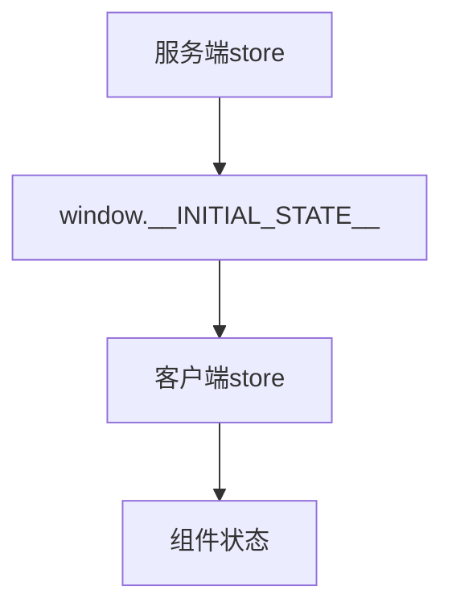

## 前言
在我进行vue ssr项目搭建学习的过程中，发现这方面有帮助的文章实在是太少了，大部分浅尝辄止。

官网文档只讲了一个大概的骨架，和相关概念的介绍，很多搭建细节并没有交代得很清楚。

而官方demo又有些许的繁杂，看懂需要一些的时间成本。

所以我以官网的构建思路自己搭建了一个可用的srr项目，旨在能够让对vue ssr感兴趣的同学能够更加快速的进行上手，通过这个项目能快速的理解vue srr的构建思路。


## 版本
这个项目主要是参照了官网和官网的demo项目vue-hackernews-2.0。所以主要框架的版本与其保持一致
vue2+webpack3

tip: 如果有想跟着一步一步搭建的同学，请一定要保持各个插件版本一致。webpack项目版本冲突实在是太草了

同时，请参考官方介绍和官方demo进行食用效果更加

https://ssr.vuejs.org/zh

https://github.com/vuejs/vue-hackernews-2.0/


## vue srr的搭建思路

首先，我们要明白普通的SPA与SSR的渲染区别是什么。

SPA由我们的打包工具例如webpack，打包生成bundle。我们将这个bundle放在我们的web服务器上比如nginx。浏览器发起请求获取到bundle然后解析吭哧吭哧的开始填充应用。

而SSR我们之前说过是在服务端已经解析生成完毕再发送到浏览器进行激活。

那么既然提到接受webpcak配置进行解析生成浏览器需要的html字符串这个过程就不得不提这张图：


> 官网介绍：所以基本看法是，对于客户端应用程序和服务器应用程序，我们都要使用 webpack 打包 - 服务器需要「服务器 bundle」然后用于服务器端渲染(SSR)，而「客户端 bundle」会发送给浏览器，用于混合静态标记。

根据介绍图和官网的解释，我们很清楚的知道。

SSR其实就等于服务端渲染+SPA，或者说是提前渲染好的的SPA

所以我们需要两份webpack配置，一份运行于**node服务端**用于服务端渲染，一份和我们原来的普通SPA配置一样运行于浏览器。而**vue-server-renderer**的功能就是混合这两份bundle生成html发送给浏览器。

所以我们的核心步骤就是配置**服务端**和**客户端**的webpack配置，然后分别打包后传入vue-server-renderer再发送给浏览器

如同下面的**官网示例**

```
const { createBundleRenderer } = require('vue-server-renderer')
// 模板
const template = require('fs').readFileSync('/path/to/template.html', 'utf-8')
// 服务端webpack配置
const serverBundle = require('/path/to/vue-ssr-server-bundle.json')
// 客户端webpack配置
const clientManifest = require('/path/to/vue-ssr-client-manifest.json')

// createBundleRenderer内调用了vue-server-renderer插件用来生成html字符串
const renderer = createBundleRenderer内调用了(serverBundle, {
  template,
  clientManifest
})
```


##  webpack配置

和普通的SPA项目一样我们准备3份配置文件，分别是

1. base基础通用配置（通过webpack-merge合并进其他配置）
1. client客户端配置。
1. server服务端配置。

老webpack人一看就觉得不对劲，那开发环境和生产环境的配置放哪？

我们这里既然分了客户端和服务端。所以开发环境和生产环境的区别配置就分别在里面进行区分了。

### base基础通用配置

base配置和普通项目的base配置并无太大区别。
主要是配置内容是

- 出入口
- 特殊文件解析（rules）
- 一些生产环境的通用优化
- 关于node的特殊处理等


```js
const path = require('path')
const webpack = require('webpack')
const ExtractTextPlugin = require('extract-text-webpack-plugin')
const FriendlyErrorsPlugin = require('friendly-errors-webpack-plugin')
const { VueLoaderPlugin } = require('vue-loader')

// 是否为生成环境
const isProd = process.env.NODE_ENV === 'production'

module.exports = {
  devtool: isProd
    ? false
    : '#cheap-module-source-map',
  output: {
    path: path.resolve(__dirname, '../dist'),
    publicPath: '/dist/',
    filename: '[name].[chunkhash].js'
  },
...
  module: {
    noParse: /es6-promise\.js$/, // avoid webpack shimming process
    rules: [
      {
        test: /\.vue$/,
       ...
      },
    ...
    ]
  },
  // node处理用于加载node模块
  node: {
    fs: 'empty',
  },
  plugins: [
  new VueLoaderPlugin()
  ]
}

```

### client客户端配置

#### 客户端入口文件
从前面我们知道需要两份webpack配置分别运行于node端和浏览器端，那么同样的入口文件也需要两份不同的文件

客户端的入口文件既然是运行于浏览器，那么我们只需创建应用程序，并且将其挂载到 DOM 中


```js

import { createApp } from './app'

// 客户端特定引导逻辑……

const { app } = createApp()

// 这里假定 App.vue 模板中根元素具有 `id="app"`
app.$mount('#app')

```

#### 客户端webpack配置

客户端配置主要功能为
- 声明客户端入口
- 配置浏览器热替换插件
- 配置vue-server-renderer客户端插件用于生成生成 `vue-ssr-client-manifest.json`


```js
const webpack = require("webpack");
const merge = require("webpack-merge");
const baseConfig = require("./webpack.base.config.js");
const VueSSRClientPlugin = require("vue-server-renderer/client-plugin");

module.exports = merge(baseConfig, {
  // 热加载
  entry: ["./src/entry-client.js", "webpack-hot-middleware/client"],
  output: {
    filename: "[name][hash].js",
  },
  plugins: [
    new webpack.HotModuleReplacementPlugin(),
    new webpack.NoEmitOnErrorsPlugin(),
    // 重要信息：这将 webpack 运行时分离到一个引导 chunk 中，
    // 以便可以在之后正确注入异步 chunk。
    // 这也为你的 应用程序/vendor 代码提供了更好的缓存。
    new webpack.optimize.CommonsChunkPlugin({
      name: "manifest",
      minChunks: Infinity,
    }),
    // 此插件在输出目录中
    // 生成 `vue-ssr-client-manifest.json`。
    new VueSSRClientPlugin(),
  ],
});

```

### server服务端配置

#### 服务端入口文件

> 服务器 entry 使用 default export 导出函数，并在每次渲染中重复调用此函数


```js

import { createApp } from './app'

export default context => {
  const { app } = createApp()
  return app
}
```

#### 服务端webpack配置

主要配置目的是：
- 声明node环境
- 声明VueSSRServerPlugin插件用于生成服务端配置
其他的配置base内早就配好了

```js
const merge = require('webpack-merge')
const nodeExternals = require('webpack-node-externals')
const baseConfig = require('./webpack.base.config.js')
const VueSSRServerPlugin = require('vue-server-renderer/server-plugin')

module.exports = merge(baseConfig, {
  // 将 entry 指向应用程序的 server entry 文件
  entry: './src/entry-server.js',

  // 这允许 webpack 以 Node 适用方式(Node-appropriate fashion)处理动态导入(dynamic import)，
  // 并且还会在编译 Vue 组件时，
  // 告知 `vue-loader` 输送面向服务器代码(server-oriented code)。
  target: 'node',

  // 对 bundle renderer 提供 source map 支持
  devtool: 'source-map',

  // 此处告知 server bundle 使用 Node 风格导出模块(Node-style exports)
  output: {
    filename: 'server-bundle.js',
    libraryTarget: 'commonjs2'
  },

  // https://webpack.js.org/configuration/externals/#function
  // https://github.com/liady/webpack-node-externals
  // 外置化应用程序依赖模块。可以使服务器构建速度更快，
  // 并生成较小的 bundle 文件。
  externals: nodeExternals({
    // 不要外置化 webpack 需要处理的依赖模块。
    // 你可以在这里添加更多的文件类型。例如，未处理 *.vue 原始文件，
    // 你还应该将修改 `global`（例如 polyfill）的依赖模块列入白名单
    whitelist: /\.css$/
  }),

  // 这是将服务器的整个输出
  // 构建为单个 JSON 文件的插件。
  // 默认文件名为 `vue-ssr-server-bundle.json`
  plugins: [
    new VueSSRServerPlugin()
  ]
})
```

## express服务器配置

配置完webpack，按照官网的意思直接分别build生成json文件，再传入VueSSRServerPlugin就完事了。

虽然这么做没错，但是要知道在实际开发中，如果每一个改动都去打包配置生成配置文件到磁盘，再生成html传到浏览器再看效果。那该是多么繁琐缓慢（sha bi）的一个过程。

老webpack人都知道在开发环境webpack生成的打包文件都是存在内存中，这样才能满足我们热更新热加载的快速响应需求。

所以我们需要在开发环境分别读取内存中的打包产物

### 开发环境读取内存文件

此配置我们需要做的是：
1. 分别读取客户端和服务端的webpack配置
1. 将客户端配置通过webpack-dev-middleware生成中间件挂载在express服务器上，用于监听文件变动自动在内存中打包
1. 将客户端配置通过webpack-hot-middleware生成中间件挂载在express服务器上，用于文件变更后通过websorcke刷新浏览器达到热加载的目的
1. 分别监听客户端与服务端打包完成事件，读取内存中的打包产物，并执行回调
                    
```js
const path = require("path");
const fs = require('fs')
const MFS = require("memory-fs");
const webpack = require("webpack");
// 读取客户端配置
const clientConfig = require("./webpack.client.config");
// 读取服务端配置
const serverConfig = require("./webpack.server.config");
// 热更新插件
const webpackHotMiddleware = require("webpack-hot-middleware");

// 读取文件
const readFile = (fs, file) => {
  try {
    return fs.readFileSync(path.join(clientConfig.output.path, file), "utf-8");
  } catch (e) {}
};
/* 
app 服务器
templatePath:模板
cb:回调方法
*/
module.exports = function setupDevServer(app,templatePath,callback) {
  // webpack包
  let bundle;
  // 客户端清单
  let clientManifest;
  // 模板
  let template;
  return new Promise((resolve) => {
    const r = ()=>{
        if (bundle && clientManifest) {
            resolve()
            callback(bundle,{
                clientManifest,
                template
            })
        }
    }
    template = fs.readFileSync(templatePath, 'utf-8')
    // 生成一个与webpack的compiler绑定的中间件，然后在express启动的服务app中调用这个中间件
    // 对更改的文件进行监控,在内存内自动打包
    const clientCompiler = webpack(clientConfig);
    const devMiddleware = require("webpack-dev-middleware")(clientCompiler, {});
    app.use(devMiddleware);
    // hot middleware
    app.use(webpackHotMiddleware(clientCompiler));
    clientCompiler.plugin("done", (stats) => {
      ...
      clientManifest = JSON.parse(
        readFile(devMiddleware.fileSystem, "vue-ssr-client-manifest.json")
      );
      r();
    });

    const serverCompiler = webpack(serverConfig);
    // 获取内存中的文件
    const mfs = new MFS();
    serverCompiler.outputFileSystem = mfs;
    serverCompiler.watch({}, (err, stats) => {
      ...
      bundle = JSON.parse(readFile(mfs, "vue-ssr-server-bundle.json"));
      r();
    });
  });
};

```


                    
### express服务器配置

在VueSSRServerPlugin生成html后我们需要起一个express服务来监听浏览器的请求，根据是否是开发环境来决定去内存中还是磁盘取webpcak编译文件

```js
const path = require("path");
const express = require("express");
const { createBundleRenderer } = require("vue-server-renderer");

// 读取绝对路径
const resolve = (file) => path.resolve(__dirname, file);
// 是否是生产环境
const isProd = process.env.NODE_ENV === "production";
// 模板路径
const templatePath = resolve("./index.template.html");

let renderer, setupPromise, bundle, clientManifest;

const app = express();

const createRenderer = (bundle, options) => {
  return createBundleRenderer(
    bundle,
    Object.assign(options, {
      basedir: resolve("./dist"),
      // recommended for performance
      runInNewContext: false,
    })
  );
};

// 如果是生产环境直接取打包好的文件
if (isProd) {
  bundle = require("../dist/vue-ssr-server-bundle.json");
  clientManifest = require("../dist/vue-ssr-client-manifest.json");
} else {
  //注意：promise内部逻辑只需要执行一次
  setupPromise = require("../build/setup-dev-server")(
    app,
    templatePath,
    // 传入回调，在webpcak，done回调完成后重新渲染页面
    (bundle, options) => {
      renderer = createRenderer(bundle, options);
    }
  );
}
// 处理错误
const handleError = (err, res) => {
 ...
};

const render = async (req, res) => {
  res.setHeader("Content-Type", "text/html");
  const context = {
  ...
  };
  renderer.renderToString(context, (err, html) => {
    if (err) {
      return handleError(err, res);
    }
    res.send(html);
  });
};

const appRender = (req, res) => {
  // 如果是生产环境直接通过文件进行生成渲染
  if (isProd) {
    render(req, res);
    return;
  }
  // 如果是开发环境则需要从内存中读取打包产物都完成后再进行渲染
  setupPromise.then(render(req, res));
};

app.get("*", appRender);

const port = process.env.PORT || 8888;
app.listen(port, () => {
  console.log(`server started at localhost:${port}`);
});

```
**特别注意**：这里面有个非常容易踩的坑，按照官网的说法同时需要服务端和客户端两个的打包产物。我们会很自然的想到在每次请求的时候用promise控制在两个打包完成回调事件都触发后读取内存中的文件再resolve掉。

如果这样做了就会产生这个报错

```
Error: [VueLoaderPlugin Error] No matching use for vue-loader is found.
Make sure the rule matching .vue files include vue-loader in its use.
```

那是因为同一份配置多次打包造成的，看尤大的解释：


也就是说我们promise内的逻辑只需要执行一次保证两份配置文件都已经完成打包后就行了，不需要每次请求都执行打包导致产生多个实例而报错。

所以我们将上一步的promise定义在外部setupPromise，执行成功后每次请求只需要执行他的回调即可，同时文件发送变动触发webpack回调事件的时候我们也监听了他的并回调重现渲染页面


## vue项目相关配置

其实走到这里，基本上一个vue的服务端渲染流程算是走通了。不过既然是vue项目，怎么能少的了vue生态老三样，
vue-router，vuex，axios

其实这些配置只需要理解一个原则就行了


服务端配置是用于服务器内预先渲染所用，客户端配置则用于浏览器端渲染所用。

也就是说发送到浏览器之前，浏览器配置没啥用。而当项目在浏览器端跑起来后，以后所有的一切则都交给客户端配置，从此以后没服务端配置什么事了。但同时我们必须保证服务端和客户端配置所产生的产物一致。

### app.js根实例
老vue开发都知道，vue项目必须有一个根实例作为入口。不过在服务端渲染中为了避免多个请求公用同一个实例导致状态污染

我们每次新的请求也就是每一次刷新都需要生成新的根实例，所以我们直接建一个工厂方法专门用于生成vue实例。


```js

import Vue from "vue";
import App from "./App.vue";
import { createRouter } from "../src/config/router.js";
import { createStore } from "../src/config/store.js";
import { sync } from "vuex-router-sync";

// 导出一个工厂函数，用于创建新的
// 应用程序、router 和 store 实例
export function createApp() {
  // 创建 router 实例
  const router = createRouter();
  const store = createStore();
  // 同步路由状态(route state)到 store
  sync(store, router);
  const app = new Vue({
    router,
    store,
    // 根实例简单的渲染应用程序组件。
    render: (h) => h(App),
  });
  return { app, router, store };
}

```


### 路由配置


首先我们建一个vue-router路由文件还是熟悉的老配方，熟悉的webpack代码分割,熟悉的history

```js
// router.js
import Vue from 'vue'
import Router from 'vue-router'

Vue.use(Router)

export function createRouter () {
  return new Router({
    mode: 'history',
    routes: [
        { path: '/',name:'home', component: () => import('../views/Home/index.vue') },
       ...
    ]
  })
}
```

然后引入到上一步我们的vue根实例中，到这一步都和老SPA一个套路

```js
const router = createRouter();

  const app = new Vue({
    router,
    // 根实例简单的渲染应用程序组件。
    render: (h) => h(App),
  });
```
最后要做到服务端与客户端同步，我们还需要手动更新服务端实例中的router对象

url为request的服务端请求字段，在spa中正好等于路由字段

```js
   // 设置服务器端 router 的位置
    router.push({ path: context.url });

    // 等到 router 将可能的异步组件和钩子函数解析完
    router.onReady(() => {
      const matchedComponents = router.getMatchedComponents();
      // 匹配不到的路由，执行 reject 函数，并返回 404
      if (!matchedComponents.length) {
        return reject({ code: 404 });
      }
    }
```

**效果**


### 数据预取和状态
终于到了我们ssr最后也是最重要的一步了，

先上官方吐槽


不过 ，对我而言首屏和seo优化虽然美好，但数据预取才是SSR项目最最动人的地方。

像我这样的业务码农，每一个业务页面，需要在vue的created，mounted钩子中请求一大堆后端接口去拿初始状态数据（往往这些接口还10个9个都还都调不通）。

如果这一步在服务端就做好了，那岂不是美滋滋。而ssr恰好就有这个能力。

> 获取的数据需要位于视图组件之外，即放置在专门的数据预取存储容器(data store)或"状态容器(state container)"中。首先，在服务器端，我们可以在渲染之前预取数据，并将数据填充到 store 中。此外，我们将在 HTML 中序列化(serialize)和内联预置(inline)状态。这样，在挂载(mount)到客户端应用程序之前，可以直接从 store 获取到内联预置(inline)状态

根据官方解释，具体步骤其实就是我们需要在客户端和服务端各插入一个store,在服务端也就是node端我们可以访问到node环境，此时我们可以做一切服务端的操作包括数据库增删改查，文件操作等。也就是此时我们将服务端获取到的数据填充到服务端的store内去。

```js

// 在所有预取钩子(preFetch hook) resolve 后，
// 我们的 store 现在已经填充入渲染应用程序所需的状态。
// 当我们将状态附加到上下文，
// 并且 `template` 选项用于 renderer 时，
// 状态将自动序列化为 `window.__INITIAL_STATE__`，并注入 HTML。

```
然后在进行浏览器渲染的时候，服务端的store会自动序列化为 window.__INITIAL_STATE__

我们真正要用这些数据的地方是在浏览器客户端，所以这一步就是连接服务端和客户端的关键，将服务端的数据序列化后赋值给**window的__INITIAL_STATE__属性**。

最后我们要做的就是讲 window.__INITIAL_STATE__ 填充至我们客户端的store内。


```js
entry-client.js
if (window.__INITIAL_STATE__) {
    store.replaceState(window.__INITIAL_STATE__)
  }
```

这样服务端获取到的数据就算真正的注入到我们的vue组件内了

大致流程：





#### 具体操作

**场景**：在不调用接口的前提下获取到某文件夹下所有文件名称

1. 服务端定义获取文件名称方法

```js
const fs = require('fs')
const path = require('path')
export const readFileName = (folderPath)=>{
 return   fs.readdirSync(folderPath).map(fileName => {
        return path.join(folderPath, fileName)
      })
}
```
2. 在store内注册该方法

```js
import { readFileName } from '../api/file'
export function createStore () {
  return new Vuex.Store({
    state: {
      fileNames: ''
    },
    actions: {
        readFileName ({ commit }) {
        return commit('setFileNames', readFileName("D://file"))
      }
    },
    mutations: {
      setFileNames (state, v) {
        state.fileNames = v
      }
    }
  })
}
```
3.在组件的asyncData钩子（该钩子在服务端被调用）中派发服务端store的内的action去服务端获取数据并注入到state中。

注意此时服务端store有了数据，客户端的store还是空的。只有当浏览器开始渲染时服务端的store才会被注入到window.__INITIAL_STATE__ 中，我们再将其注入到浏览器的store中才算完成。

最后我们将客户端store的对应state注入到组件中，并渲染到页面

```js
<template>
    <div class>
        home
        <p v-for="it in item">{{it}}</p>
    </div>
</template>

<script>
export default {
    asyncData({ store, route }) {
        return store.dispatch('readFileName', 'D://file')
    },
    computed: {
        item() {
            return this.$store.state.fileNames
        }
    }
}
</script>
 
```

**效果**


## 总结
至此，我们vue的服务端渲染项目基本上算是搭建完成。当然其中所有功能点都只是一个基本实现。还有很多需要优化的空间，仅用于学习理解vue ssr渲染流程。

虽然比起直接用nuxt现成框架，看似我们直接配置vue ssr项目好像做了很多东西，其实终归是调用
vue-server-renderer插件来实现我们的目的。

此项目也仅是我个人学习的一个记录和总结，希望能帮助到对vue ssr有兴趣的同学，若有错误的地方也请大佬们不吝赐教。


